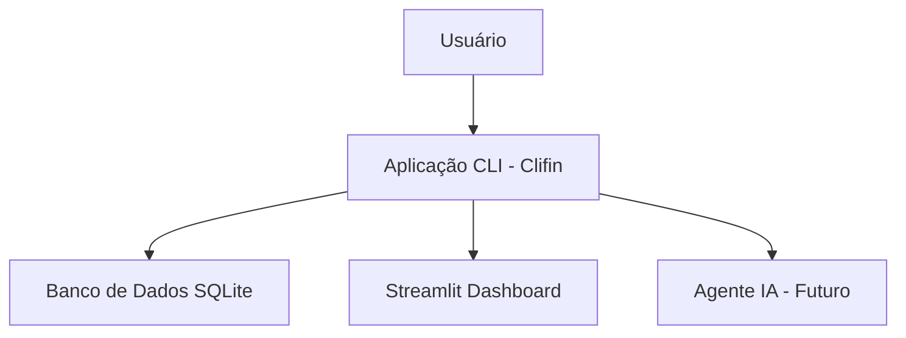

# Clifin - CLI-based Personal Finance Manager

Projeto para a disciplina de Programação para Ciência de Dados do MBA Ciência de Dados - UNIFOR.

| Informações básicas | Clifin - Personal Finance Manager |
|----|----|
| **Disciplina** | Programação para Ciência de Dados |
| **Curso** | MBA Ciência de Dados - UNIFOR |
| **Instrutor** | Cássio Pinheiro |
| **Integrantes** | Lucas Sales Carvalho Carioca (2528138) |
| **Repositório GitHub** | https://github.com/lucasscarioca/clifin |
| **Data de Entrega** | 14/11/2025 |

## Objetivo do Projeto

O Clifin é uma aplicação de linha de comando (CLI) desenvolvida em Python para auxiliar no gerenciamento pessoal de finanças. Permite aos usuários registrar receitas e despesas, visualizar transações e obter insights básicos sobre seus hábitos financeiros.

O projeto visa resolver o problema da falta de ferramentas simples e acessíveis para controle financeiro pessoal, especialmente para aqueles que preferem interfaces de texto ou precisam de uma solução leve e offline.

Público-alvo: Indivíduos interessados em finanças pessoais, estudantes e profissionais que desejam uma ferramenta prática para análise de dados financeiros.

## Diagrama de Contexto

O sistema Clifin opera como uma aplicação CLI que interage diretamente com o usuário via terminal. Ele utiliza um banco de dados SQLite local para armazenar as transações financeiras.

Diagrama simplificado:
- **Usuário** → Interage com comandos CLI (adicionar, listar, etc.)
- **Aplicação CLI (Clifin)** → Processa comandos, valida dados, acessa banco de dados
- **Banco de Dados SQLite** → Armazena transações (receitas/despesas) e metadados
- **Dashboard Streamlit** → Exibição dos dados registrados na aplicação

Futuramente, será integrado com um agente de IA para consultas conversacionais.



## Funcionalidades

### Funcionalidades Atuais:
- **Adicionar Transação**: Permite registrar novas receitas ou despesas com data, descrição e valor. Utiliza o módulo `transaction_repository` para persistência.
- **Listar Transações**: Exibe todas as transações armazenadas, com filtros opcionais. Usa o modelo `Transaction` e repositório para consulta.
- **Inicializar Banco de Dados**: Comando para criar e migrar o banco de dados SQLite. Utiliza Alembic para migrações.
- **Análise Exploratória de Dados (EDA)**: Notebook para gerar estatísticas descritivas, gráficos e insights sobre os dados financeiros registrados.
- **Dashboard Web com Streamlit**: Comando para iniciar um servidor web local exibindo dashboard com visualizações dos dados financeiros.

### Funcionalidades Planejadas:
- **Chat com Agente de IA**: Comando para interagir com um assistente virtual que responde perguntas sobre as finanças pessoais, utilizando contexto dos dados armazenados.

## Estrutura de Dados

O principal modelo de dados é a `Transaction`, representada por uma dataclass com os campos:
- `id`: Identificador único (inteiro)
- `title`: Nome da transação (string)
- `amount`: Valor da transação (float, positivo para receitas, negativo para despesas)
- `category`: Categproa da transação (string)
- `date`: Data da transação (string no formato YYYY-MM-DD)
- `description`: Descrição da transação (string opcional)
- `created_at`: Data de criação da transação (string no formato YYYY-MM-DD)

Exemplo de entrada: Comando `uv run clifin add "Salário" 3000 "Freelancer" --date 2025-11-01`

Exemplo de saída: Lista de transações exibida em formato tabular no terminal.

Os dados são armazenados em banco SQLite, sem uso de arquivos externos como CSV.

## Requisitos técnicos

- **Python**: Versão 3.13 ou superior
- **Bibliotecas**: Typer (para CLI), Alembic (para migrações), SQLite3 (integrado ao Python)
- **Gerenciamento de Dependências**: Utiliza `uv` para instalação e gerenciamento
- **Sistema**: Compatível com Windows, macOS e Linux (sem requisitos especiais)

Para instalar as dependências: Execute `uv sync` no diretório do projeto.

## Como executar o projeto

1. **Instalação**: Clone o repositório e execute `uv sync` para instalar dependências.
2. **Inicialização**: Execute `uv run clifin init` para criar e migrar o banco de dados.
3. **Execução**: Use `uv run clifin --help` para ver comandos disponíveis, ou diretamente `uv run clifin add` para adicionar transações.

Exemplo de uso:
- Adicionar receita: `uv run clifin add "Salário" 3000 "Freelancer" --date 2025-11-01`
- Listar transações: `uv run clifin list`
- Resumo de transações: `uv run clifin summary`
- Abrir dashboard: `uv run clifin dashboard`

### Instalação global

A partir da raiz deste repositório, execute: `uv tool install . -e`
- Utilize flag `-e` em desenvolvimento para garantir que seja uma instação "editável", para que alterações realizadas no código fonte do repositório reflitam automaticamente.

### Comandos disponíveis

- Exibir comandos disponíveis: `clifin --help`
- Inicializar banco de dados: `clifin init`
- Adicionar receita: `clifin add {...}`
- Adicionar despesa: `clifin sub {...}`
- Remover registro: `clifin delete {id}`
- Atualizar registro: `clifin update {id} {...}`
- Exibir resumo financeiro: `clifin summary`
- Exibir lista de transações: `clifin list`
- Abrir dashboard Streamlit: `clifin dashboard`

## Análises realizadas

A implementação das análises pode ser encontrada no arquivo `clifin_eda.ipynb`, onde podemos observar estatísticas e visualizações como:

1. Distribuição das transações
2. Receitas e despesas por categoria e quanto cada categoria representa do total de transações
3. Análise comparativa de receitas vs despesas ao decorrer dos meses
4. Distribuição dos valores de receitas e depesas (Histogramas e Boxplot) e estatísticas descritivas dos valores de receitas e despesas (através da função `describe()`)
5. Matriz de correlação e detalhamento das maiores correlações com o valor (`amount`)
6. Média de despesas por mês e como as principais categorias de despesas evoluem ao longo do tempo
7. Resumo com total de transações por tipo, categorias com mais transações, melhor e pior mês

As análises foram realizadas com base em transações fictícias geradas a partir do script `seed_db.py` para popular a base de dados da aplicação.

## Estrutura do Projeto

- `src/clifin/`: Código fonte principal
  - `db/`: Configuração do banco de dados e conexões
  - `models/`: Definições de modelos de dados (ex: Transaction)
  - `repositories/`: Camada de acesso a dados
  - `__init__.py`: Inicialização do pacote. Ponto de entrada da aplicação CLI
  - `dashboard.py`: Script para hospedar dashboard Streamlit em `localhost:8501` através do comando `clifin dashboard`
- `migrations/`: Scripts de migração do banco com Alembic
- `pyproject.toml`: Configuração do projeto e dependências
- `clifin_eda.ipynb`: Jupyter Notebook com implementação da análise exploratória dos dados da aplicação
- `seed_db.py`: Script para popular banco de dados com dados fictícios

## Capturas de Tela / Exemplos de saída

Atualmente, a aplicação roda no terminal sem interface gráfica. Exemplo de saída do comando `list`:

```
ID    Date         Title                Category        Amount    
----------------------------------------------------------------------
200   2025-11-10   Year-end Bonus       Bonus           +$1016.75 
199   2025-11-08   Bus Ticket           Transportation  $-104.67  
198   2025-11-07   Year-end Bonus       Bonus           +$1350.64 
197   2025-11-05   Furniture            Home            $-563.31  
```

No repositório pode ser encontrado o notebook `clifin_eda.ipynb` com a implementação da análise exploratório dos dados registrados na aplicação.
Futuramente, serão incluídas capturas de dashboards Streamlit e exemplos de conversas com IA.

## Testes Realizados

Testes ainda não implementados. Planejamos adicionar:
- Testes unitários para repositórios e modelos
- Testes de integração para comandos CLI
- Scripts para popular base de dados de teste para validar EDA
- Validações de entrada de dados e tratamento de erros

## Referências e Bibliografia

- UV para gerenciamento do projeto Python: https://docs.astral.sh/uv/
- Typer para CLI: https://typer.tiangolo.com/
- Alembic para migrações: https://alembic.sqlalchemy.org/
- Streamlit para dashboard web: https://docs.streamlit.io/

## Contribuições dos Integrantes

- **Lucas Sales Carvalho Carioca**: Desenvolvimento do projeto, incluindo arquitetura, implementação de funcionalidades básicas, configuração de banco de dados e documentação.

## Próximos Passos / Melhorias Futuras

- Integrar agente de IA para consultas conversacionais sobre finanças
- Adicionar suíte de testes completa, incluindo scripts para popular dados de teste
- Melhorias técnicas: Suporte a múltiplas moedas, registro de compras parceladas (valor divididos em N meses), exportação para CSV
