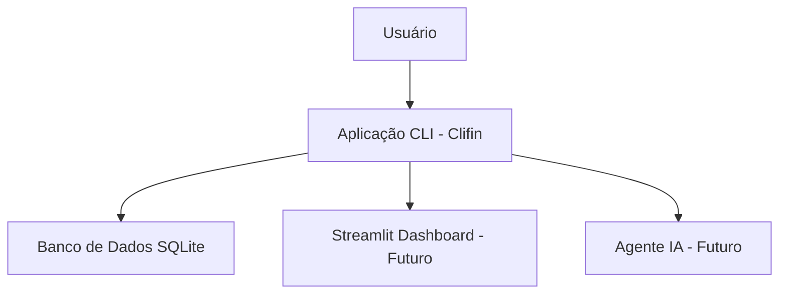

# Clifin - CLI-based Personal Finance Manager

Projeto para a disciplina de Programação para Ciência de Dados do MBA Ciência de Dados - UNIFOR.

| Informações básicas | Clifin - Personal Finance Manager |
|----|----|
| **Disciplina** | Programação para Ciência de Dados |
| **Curso** | MBA Ciência de Dados - UNIFOR |
| **Instrutor** | Cássio Pinheiro |
| **Integrantes** | Lucas Sales Carvalho Carioca (2528138) |
| **Repositório GitHub** | https://github.com/lucasscarioca/clifin |
| **Data de Entrega** | 14/11/2024 |

## Objetivo do Projeto

O Clifin é uma aplicação de linha de comando (CLI) desenvolvida em Python para auxiliar no gerenciamento pessoal de finanças. Permite aos usuários registrar receitas e despesas, visualizar transações e obter insights básicos sobre seus hábitos financeiros.

O projeto visa resolver o problema da falta de ferramentas simples e acessíveis para controle financeiro pessoal, especialmente para aqueles que preferem interfaces de texto ou precisam de uma solução leve e offline.

Público-alvo: Indivíduos interessados em finanças pessoais, estudantes e profissionais que desejam uma ferramenta prática para análise de dados financeiros.

## Diagrama de Contexto

O sistema Clifin opera como uma aplicação CLI que interage diretamente com o usuário via terminal. Ele utiliza um banco de dados SQLite local para armazenar as transações financeiras.

Diagrama simplificado:
- **Usuário** → Interage com comandos CLI (adicionar, listar, etc.)
- **Aplicação CLI (Clifin)** → Processa comandos, valida dados, acessa banco de dados
- **Banco de Dados SQLite** → Armazena transações (receitas/despesas) e metadados

Futuramente, será integrado com Streamlit para dashboards web e um agente de IA para consultas conversacionais.



## Funcionalidades

### Funcionalidades Atuais:
- **Adicionar Transação**: Permite registrar novas receitas ou despesas com data, descrição e valor. Utiliza o módulo `transaction_repository` para persistência.
- **Listar Transações**: Exibe todas as transações armazenadas, com filtros opcionais. Usa o modelo `Transaction` e repositório para consulta.
- **Inicializar Banco de Dados**: Comando para criar e migrar o banco de dados SQLite. Utiliza Alembic para migrações.

### Funcionalidades Planejadas:
- **Análise Exploratória de Dados (EDA)**: Comando para gerar estatísticas descritivas, gráficos e insights sobre os dados financeiros. Utilizará bibliotecas como Pandas e Matplotlib.
- **Dashboard Web com Streamlit**: Comando para iniciar um servidor web local exibindo dashboards interativos com visualizações dos dados financeiros.
- **Chat com Agente de IA**: Comando para interagir com um assistente virtual que responde perguntas sobre as finanças pessoais, utilizando contexto dos dados armazenados.

## Estrutura de Dados

O principal modelo de dados é a `Transaction`, representada por uma dataclass com os campos:
- `id`: Identificador único (inteiro)
- `date`: Data da transação (string no formato YYYY-MM-DD)
- `description`: Descrição da transação (string)
- `amount`: Valor da transação (float, positivo para receitas, negativo para despesas)
- `type`: Tipo ('income' ou 'expense')

Exemplo de entrada: Comando `add --date 2024-11-01 --description "Salário" --amount 3000.00 --type income`

Exemplo de saída: Lista de transações exibida em formato tabular no terminal.

Os dados são armazenados em banco SQLite, sem uso de arquivos externos como CSV.

## Requisitos técnicos

- **Python**: Versão 3.13 ou superior
- **Bibliotecas**: Typer (para CLI), Alembic (para migrações), SQLite3 (integrado ao Python)
- **Gerenciamento de Dependências**: Utiliza `uv` para instalação e gerenciamento
- **Sistema**: Compatível com Windows, macOS e Linux (sem requisitos especiais)

Para instalar as dependências: Execute `uv sync` no diretório do projeto.

## Como executar o projeto

1. **Instalação**: Clone o repositório e execute `uv sync` para instalar dependências.
2. **Inicialização**: Execute `uv run main.py init` para criar e migrar o banco de dados.
3. **Execução**: Use `uv run main.py` para ver comandos disponíveis, ou diretamente `uv run main.py add` para adicionar transações.

Exemplo de uso:
- Adicionar receita: `uv run main.py add --date 2024-11-01 --description "Salário" --amount 3000.00 --type income`
- Listar transações: `uv run main.py list`

## Análises realizadas

Atualmente, o projeto não possui análises implementadas. Planejamos implementar EDA com:
- Estatísticas descritivas: média, mediana, desvio padrão de receitas/despesas
- Visualizações: Gráficos de barras para categorias, linhas para evolução temporal
- Insights: Identificação de padrões de gastos, alertas para orçamentos

Futuramente, serão calculadas métricas como saldo mensal e proporção de despesas por categoria.

## Estrutura do Projeto

- `src/`: Código fonte principal
  - `db/`: Configuração do banco de dados e conexões
  - `models/`: Definições de modelos de dados (ex: Transaction)
  - `repositories/`: Camada de acesso a dados
- `migrations/`: Scripts de migração do banco com Alembic
- `main.py`: Ponto de entrada da aplicação CLI
- `pyproject.toml`: Configuração do projeto e dependências

## Capturas de Tela / Exemplos de saída

Atualmente, a aplicação roda no terminal sem interface gráfica. Exemplo de saída do comando `list`:

```
ID | Date       | Description | Amount  | Type
1  | 2024-11-01 | Salário     | 3000.00 | income
2  | 2024-11-02 | Mercado     | -150.00 | expense
```

Futuramente, serão incluídas capturas de dashboards Streamlit e exemplos de conversas com IA.

## Testes Realizados

Testes ainda não implementados. Planejamos adicionar:
- Testes unitários para repositórios e modelos
- Testes de integração para comandos CLI
- Scripts para popular base de dados de teste para validar EDA
- Validações de entrada de dados e tratamento de erros

## Referências e Bibliografia

- UV para gerenciamento do projeto Python: https://docs.astral.sh/uv/
- Typer para CLI: https://typer.tiangolo.com/
- Alembic para migrações: https://alembic.sqlalchemy.org/

## Contribuições dos Integrantes

- **Lucas Sales Carvalho Carioca**: Desenvolvimento completo do projeto, incluindo arquitetura, implementação de funcionalidades básicas, configuração de banco de dados e documentação. Responsável por todos os commits no repositório.

## Próximos Passos / Melhorias Futuras

- Implementar análise exploratória de dados (EDA) com Pandas e visualizações
- Adicionar dashboard web usando Streamlit para visualizações interativas
- Integrar agente de IA para consultas conversacionais sobre finanças
- Adicionar suíte de testes completa, incluindo scripts para popular dados de teste
- Melhorias técnicas: Suporte a múltiplas moedas, categorias de transações, exportação para CSV
